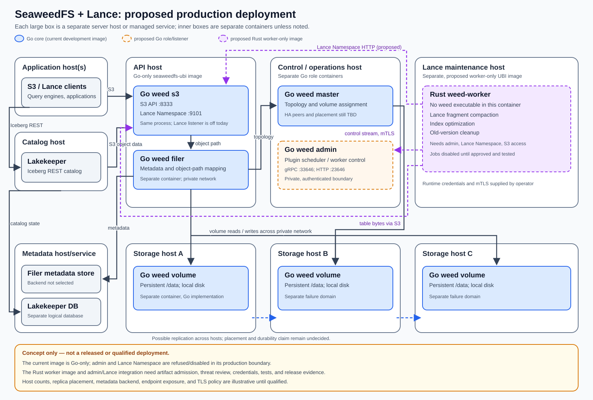

# Proposed production topology with Lance maintenance

This diagram is a design discussion, **not** a released or qualified deployment.
The existing Go-only image and production role allowlist have not changed.

The API host runs `weed s3` and `weed filer` as separate Go-role containers.
The S3 API serves object clients and Lakekeeper, which remains the Iceberg REST
catalog. SeaweedFS's Lance Namespace listener is in the **same `weed s3`
process**, but is disabled by this image today. Enabling it would require a
separate support and cyber decision; Lakekeeper is not shown as a substitute
for this worker's Lance Namespace API.

The control/operations host runs a Go master container. A separate Go admin
container is proposed to schedule plugin workers; the current image refuses
that role. The Lance maintenance host runs only `weed-worker` in a proposed
worker-only UBI image—**it does not need the `weed` executable**. The worker
would connect to the admin gRPC service, the Lance Namespace endpoint, and the
S3 object path. The admin and worker require distinct authentication, network,
credential, observability, and job-safety qualification.

Three storage hosts illustrate separate failure domains, each with a Go
`weed volume` container and persistent data. Their count is illustrative, not
a validated replica placement, availability, or durability claim. The filer
metadata backend and its host/managed-service shape remain undecided. The
diagram shows a separate logical database for Lakekeeper without selecting its
backend or physical host. The master's high-availability layout must also be
chosen before production deployment.
The diagram's lines show representative dependencies, not a complete port or
network-policy matrix.

`mini` is not shown: it is a separate development profile and cannot establish
multi-host, worker, or replicated-volume evidence. All new admin, Lance, and
worker paths are unqualified until the
[Rust adoption plan](../RUST-ALTERNATIVES-PLAN.md) and the release gates close.
